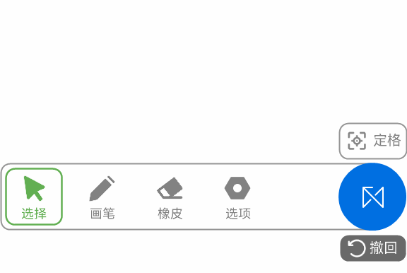
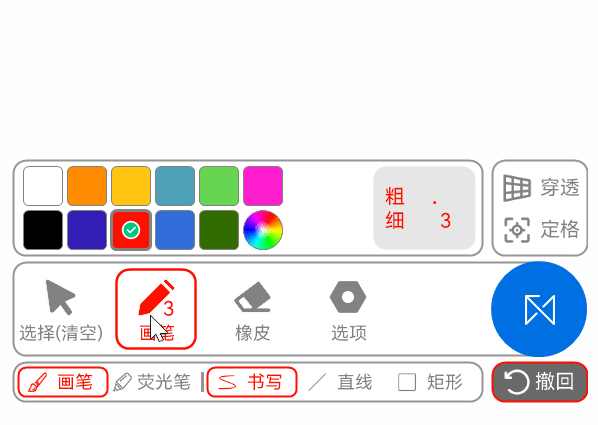
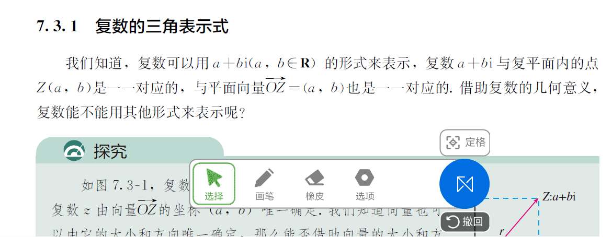

# 基础指南

本部分内容将帮助您掌握基本的软件操控方法。（例如如何开始批注以及如何调整批注的画笔颜色和粗细等）  

### 打开和收起主栏
当你打开软件主程序时，你会看到一个悬浮窗，点击它即可打开主栏，再次点击即可收起主栏。  

{ width="50%" }  

### 开始批注
点击```画笔```按钮，你会进入到绘制模式，然后你就可以进行批注。再点击一下选择按键即可清空并切换至选择模式。  

{ width="50%" }

### 使用橡皮擦除墨迹
在绘制模式点击```橡皮```按钮即可进行擦除。  

{ width="50%" }

### 画笔调节、图形和荧光笔
在绘制模式再次点击```画笔```按钮即可调整画笔粗细、颜色等参数。**点击对应的颜色**即可调节，点击旁边的粗细，则可以通过预设粗细或滑动条来调整粗细。  

{ width="50%" }

软件内置矩形和直线绘图，在再次点击```画笔```按钮时弹出的按钮可以选中并使用。  

{ width="50%" }

此外，软件自带```荧光笔```，点击对应的按钮即可使用。  

{ width="50%" }

## 小提示

### 快速选择颜色
按住绘制图标后上划，可以展开绘制菜单，并**快速选择颜色**。  
{ width="50%" }

### 触发条件收起主栏
可选地，当满足下列条件时，可以自动收起主栏：
- 画笔绘制时收起主栏
- 橡皮擦除时收起主栏
- 拖动主栏时收起主栏
- 点击时收起主栏（仅在非选择模式下，点击非主栏区域时生效）

!!! tip "提示"
    相关功能的启用与关闭在 软件选项->常规->其他行为 中设定。

{ width="50%" }

---

还在逐步完善中。  
更多细分介绍指南，请转到文档进阶指南页面。  