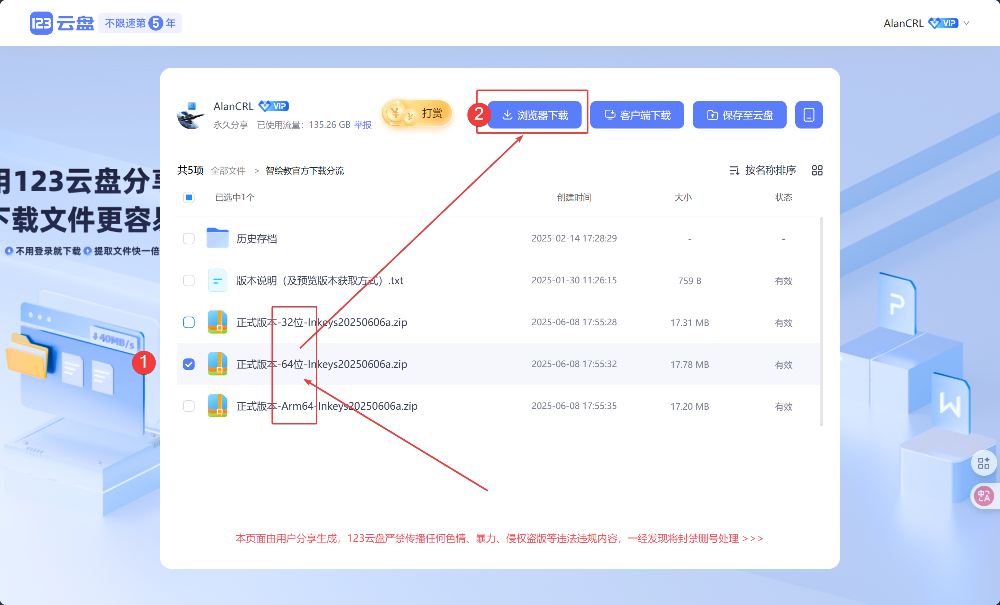
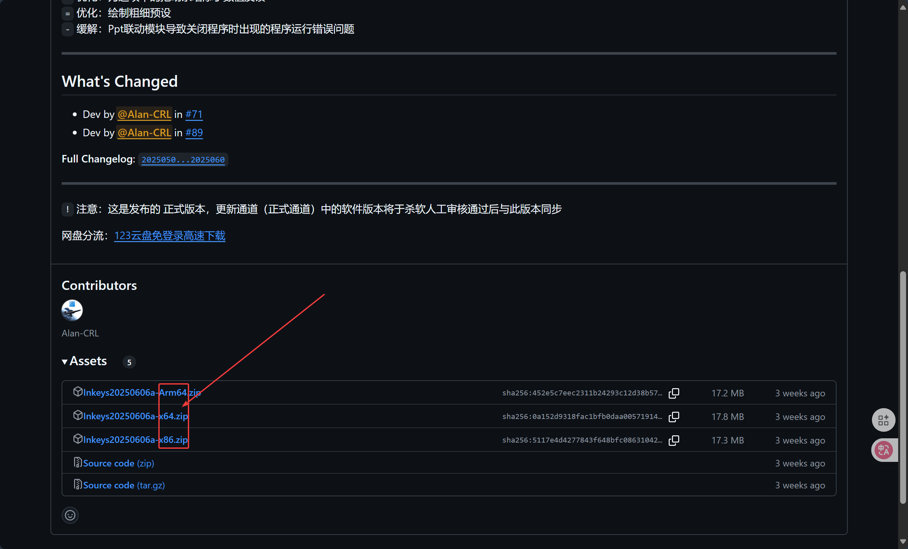
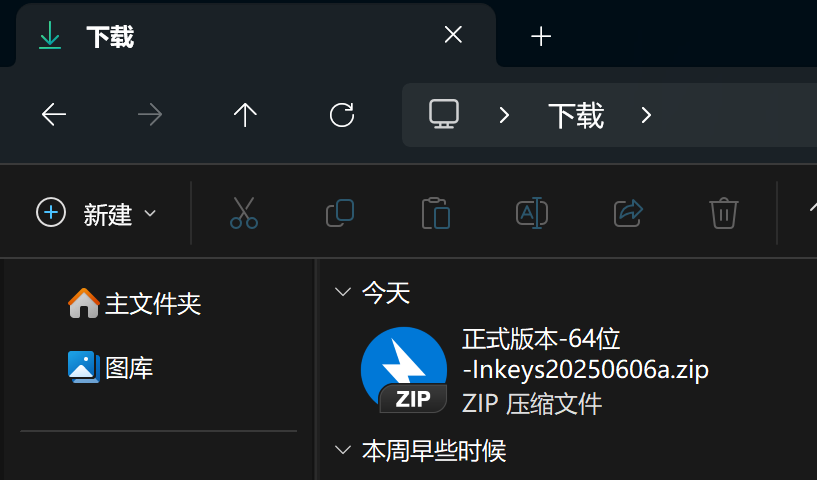
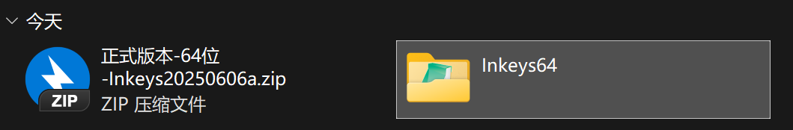
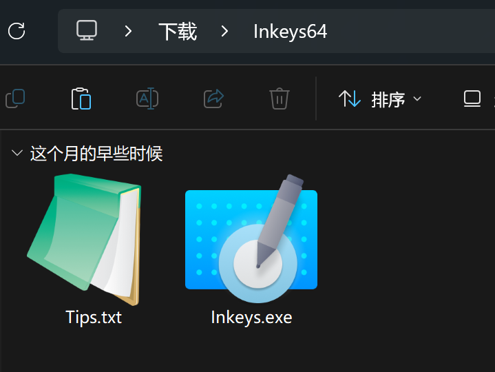
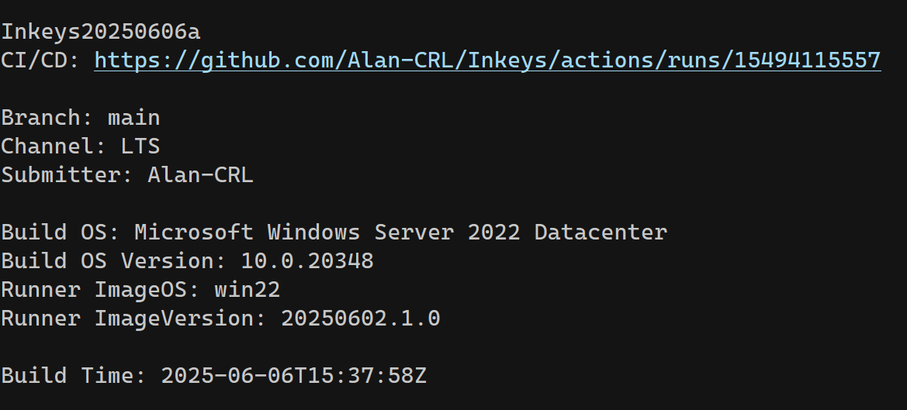

# 5 分钟内快速上手 :partying_face:

准备好，我们开始了~ :alarm_clock:

---

## 第一步：下载 智绘教Inkeys

智绘教Inkeys 支持 Windows 7 RTM(sp0) 及以上版本。

### 准备

在下方的网页中，选择合适的 __系统架构__ 版本，并下载。  
提供 `64位` `32位` `Arm64` 版本，需要下载匹配的版本。  

-   :material-download:{ .lg .middle } __123云盘下载（推荐）__

    ---

    链接为免登录不限速设计，点击下载即可

    [:octicons-arrow-right-24: 前往下载](https://www.123pan.com/s/duk9-n4dAd.html){ target="_blank" }

-   :material-book-edit:{ .lg .middle } Github Release

    [查看 Github Release](https://github.com/Alan-CRL/Inkeys/releases){ target="_blank" }

{==

==}

??? note "我该如何手动确定系统的架构？"
    - [百度一下](https://www.baidu.com/s?wd=%E5%A6%82%E4%BD%95%E6%9F%A5%E7%9C%8B%20Windows%20%E6%9E%B6%E6%9E%84){ target="_blank" }
    - 自己搜搜：__如何查看 Windows 架构__

### 下载

1. 选择合适的版本并选择下载  
{ width="48%" } { width="48%" }  

2. 下载完成后会得到一个压缩包。{ width="50%" align=right }   

### 解压

1. 使用解压软件，将软件解压出来。{ width="50%" align=right }  
2. 打开解压后的文件夹，即可看到运行文件。{ width="50%" align=right }  

---

??? note "`Tips.txt` 文件中包含使用提示和 CI/CD 详细信息"
    CI/CD（自动构建） 包含构建的软件版本，构建时间和构建系统等等。{ width="30%" align=right }

## 启动 智绘教Inkeys

双击 `Inkeys.exe` 即可启动程序。